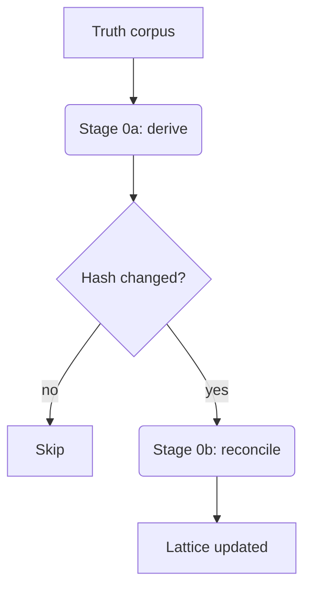

# LLM Wiki

A persistent, hand-curated wiki for the TeamOfTen harness. Adapted
from Andrej Karpathy's LLM-wiki gist, with one deliberate deviation:
**standard markdown links instead of `[[wikilinks]]`** (the harness
renderer is CommonMark/GFM via `marked`, which doesn't parse double
brackets).

## Why a wiki (not just RAG)

Knowledge should **compound** over time. Instead of every agent
re-deriving the same insight from raw sources or chat history, the
wiki is a structured, interlinked collection of markdown that grows
turn after turn. New learnings get *integrated* into existing pages
(cross-references updated, contradictions flagged) rather than piled
into a flat search index.

The pattern solves the maintenance burden that kills human-maintained
wikis: agents handle the tedious bookkeeping (updating references,
keeping consistency, noting contradictions); humans focus on curation
and strategic questions.

## Three-layer architecture

1. **Raw sources** — immutable inputs you curate: project files,
   uploads, decisions, repo code, external articles. Live under
   `/data/projects/<slug>/{uploads,decisions,repo}/` and
   `/data/projects/<slug>/working/knowledge/`. Never overwritten by
   the wiki.
2. **The wiki itself** — agent-maintained markdown pages: concept
   pages, entity pages, summaries. Lives under `/data/wiki/`.
3. **The schema** — this file (the skill). Defines structure,
   conventions, and the three operations below.

## Three operations

- **Ingest** — when a new source arrives (a decision, a research note,
  a debugging insight): read it, identify what's worth keeping,
  write or update the relevant wiki page(s), and link from related
  pages. One concept per file.
- **Query** — when answering a question, search the wiki first
  (`/data/wiki/INDEX.md` is the entry point). Synthesize an answer
  from existing pages; if the synthesis itself is valuable, file it
  back as a new page.
- **Lint** — periodically (or when you notice drift) audit for
  contradictions, orphaned pages, missing cross-references, and
  stale entries. Fix in place.

## When to create an entry

Create a wiki entry when you encounter something that:

- Took effort to figure out (a non-obvious gotcha, a debugging
  insight, a config nuance) — the next agent shouldn't have to
  re-derive it.
- Is a durable piece of project context (a stakeholder's preference,
  a glossary term, a domain rule) that lives longer than a single
  task and isn't already in CLAUDE.md.
- Crosses tasks or sessions — it's bigger than a `coord_write_knowledge`
  artifact (which is more like a one-shot deliverable) and smaller
  than a full CLAUDE.md section.

Don't create an entry for:

- Ephemeral state ("we're currently doing X") — that's an inbox
  message or a task update.
- Code itself — code lives in the repo, not the wiki.
- Things already documented in CLAUDE.md or Docs/TOT-specs.md.

## Format

- **One concept per file.** Resist the urge to bundle.
- **Filename:** kebab-case derived from the concept.
  - Good: `webdav-conflict-detection.md`
  - Bad: `notes-1.md`, `WebDAVConflicts.md`
- **Frontmatter (YAML):**
  ```yaml
  ---
  title: WebDAV conflict detection
  tags: [sync, webdav]
  created: 2026-04-25
  updated: 2026-04-25
  links: [/data/wiki/sync-state.md, /data/wiki/misc/upload-flow.md]
  ---
  ```
- **Body:** standard markdown. Open with a 1-2 sentence summary so a
  future agent skimming `INDEX.md` link previews can decide whether
  to read further.

## Where entries go

- **Project-specific learning** → `/data/wiki/<project_slug>/<entry-filename>.md`
- **Cross-project shared concept** → `/data/wiki/<entry-filename>.md`
  (root, alongside INDEX.md)

`<project_slug>` is the project's id (e.g. `misc`, `simaero-rebrand`).
`<entry-filename>` is the kebab-case concept name (e.g.
`webdav-conflict-detection`). A project slug names a folder; an
entry filename names a `.md` file inside it.

## Linking

Use **standard markdown links**, not `[[wikilinks]]`:

- Within a project's wiki:
  `[other concept](./other-concept.md)`
- Cross-project shared root:
  `[shared concept](/data/wiki/shared-concept.md)`
- Between projects:
  `[../other-project/concept](../other-project/concept.md)`
- To project working files:
  `[plan A](/data/projects/<slug>/working/plans/a.md)`

Absolute paths starting with `/data/` are clickable in the harness
UI's Files pane (the file-link resolver opens the matching root
+ relative path). Relative paths work too.

## Navigation files

Two special files assist navigation at the wiki root:

- **`/data/wiki/INDEX.md`** — auto-maintained content catalog,
  organized by project / cross-project group. **Do NOT edit
  directly.** Just write your entry; the harness appends a link line
  on every wiki write event. If it gets out of sync (manual edits,
  file copy, restore from snapshot), it self-heals on the next wiki
  write.
- **`/data/wiki/log.md`** — append-only chronological record of
  wiki activity (entries created/updated, lint passes, contradictions
  noted). Useful for "what changed lately?" queries.

## Diagrams (Mermaid)

The harness renders fenced ` ```mermaid ` blocks as inline SVG. Use
diagrams for state machines, sequence flows, decision trees, and
architecture sketches — anything where the visual structure carries
meaning that a bullet list flattens. Renders identically in the
harness UI and in Obsidian (which has built-in Mermaid support too).

````markdown

````

Common diagram types: `graph TD/LR` (flowcharts), `sequenceDiagram`,
`stateDiagram-v2`, `classDiagram`, `erDiagram`, `gantt`, `mindmap`.
Full syntax: see https://mermaid.js.org/intro/.

Mermaid lazy-loads on first diagram (~3MB JS), then caches. Subsequent
diagrams render instantly. If a diagram fails to parse, the harness
shows the source + the parser error inline so you can fix it.

## Math (LaTeX)

Inline math with single dollars (`$ ... $`); display math with double
dollars (`$$ ... $$`):

```markdown
The Bayesian update is $P(H|E) = P(E|H) P(H) / P(E)$.

For matrices use display mode:

$$
A = \begin{bmatrix} a & b \\ c & d \end{bmatrix}
$$
```

Rendered via KaTeX. The output carries both styled HTML (visual) AND
hidden MathML (so equations copy-paste into Word and Office apps as
real equation objects, not as flat text). Most LaTeX from research
papers works directly — Greek letters, fractions, integrals, sums,
products, sub/superscripts, matrices, alignment, common environments.
For exotic packages or TikZ diagrams, use a Mermaid diagram instead
or store the rendered image alongside the wiki entry.

If KaTeX can't parse the source, the equation renders red inline (the
rest of the page is unaffected). Common gotchas: a stray single `$`
in plain text can trigger inline-math mode — escape with `\$`.

## Don't

- Don't write entries that summarize the codebase — agents read code
  directly.
- Don't link via `[[double brackets]]` — the renderer ignores them
  (this is the deliberate deviation from Karpathy's gist).
- Don't create entries for tasks-in-flight; use `coord_send_message`
  or task notes for those.
- Don't edit `INDEX.md` by hand — it's auto-maintained.
